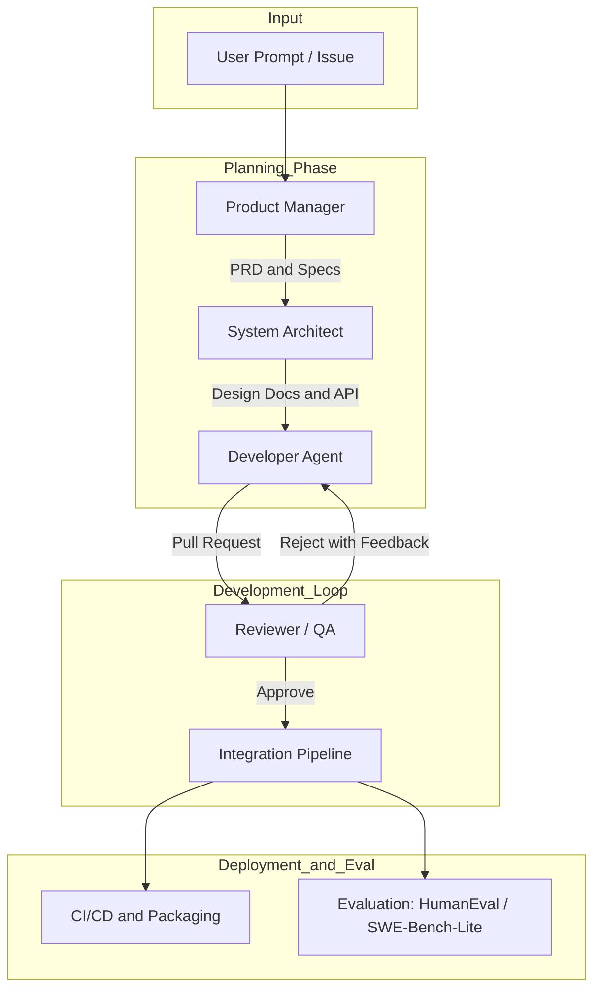
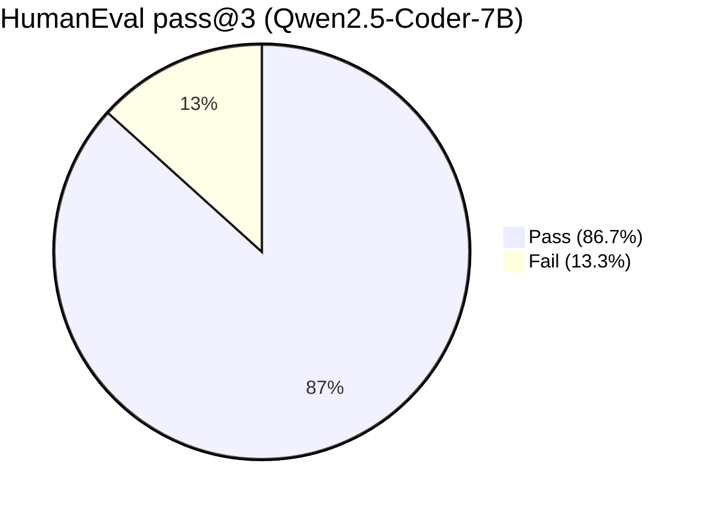

# MASWE: Multi-Agent Software Engineering System

MASWE (Multi-Agent Software Engineering) is a research-driven orchestration framework that simulates the **entire software development lifecycle** using autonomous LLM agents. Its goal is to evaluate whether structured collaboration among **lightweight local LLMs** (e.g., Qwen, DeepSeek) can approach the abilities of **large-scale cloud models** (GPT-4, Claude, Gemini).

The system runs in a fully reproducible Docker environment and coordinates four core agents—**Product Manager, Architect, Developer, Reviewer**—to turn natural-language tasks into fully working, tested software.

---

# Table of Contents

- Overview  
- Architecture  
- System Components  
- Key Features  
- Workflow Pipeline  
- Installation & Usage  
- Evaluation & Benchmarks  
- Project Structure  
- Contributing  
- License  

---

# Overview

MASWE provides:

- 🔧 **Unified LLM Backend Layer**: Local (Qwen / DeepSeek / Llama) + cloud (OpenAI / Anthropic / Google)
- 🧠 **MetaGPT-style orchestration** for full SWE lifecycle  
- 📦 **Full Docker isolation**  
- 📊 **Built-in evaluation suite** (HumanEval, SWE-Bench-Lite)  
- 📝 **Agent logging & workflow traces**  

MASWE’s design goal is both research utility and reproducibility.

---

# Architecture



---

# System Components

| Role | Responsibility | Output |
|------|---------------|--------|
| Product Manager | Requirements engineering | PRD.md |
| System Architect | System design, data models, API specs | design.md |
| Developer | Implementation based on design | Source code |
| Reviewer / QA | Static analysis, test execution | Review report |
| Orchestrator | Routing, workflow state, multi-agent coordination | workflow_trace.json |

---

# Key Features

### 1. Hybrid Local/Cloud LLM Backend
- Supports: **Qwen2.5-Coder**, DeepSeek-Coder, Llama 3 (local via OLLAMA)
- Cloud inference via **OpenAI, Anthropic, Gemini**
- Cloud model configs are edit-in-YAML (compatible with MetaGPT-style configs)  
  👉 YAML examples: https://github.com/FoundationAgents/MetaGPT

### 2. MetaGPT-Like Multi-Agent Orchestration
- Role → Action → Memory pattern  
- Persistent agent context and project state  
- Artifact passing between agents (PRD → Design → Code → Review)

### 3. Full Docker Reproducibility
- No host pollution  
- Mounted volume for `workspace/<run_id>`  
- Deterministic logs + artifacts  

### 4. Built-In Evaluation Suite
- HumanEval (Pass@k)
- SWE-Bench-Lite
- LLM performance logging (token counts, latency)  
- LLM call tracing (prompt + completion stored in JSONL)

---

# Workflow Pipeline

1. **Product Manager** → Interprets user task, drafts PRD  
2. **Architect** → Creates technical design (API, modules, data flow)  
3. **Developer** → Generates patch-based implementation  
4. **Reviewer** → Executes tests, produces QA report  
5. **Integration** → Packages final deliverable  
6. **Evaluation** → Runs HumanEval / SWE-Bench pipelines  

---

# Installation & Usage

### Prerequisites
- Docker
- Optional API keys for cloud LLMs
- Optional Ollama for local inference

---

## 1. Build Docker Image

```bash
docker build -t maswe_v1 .
```

---

## 2. Run MASWE with a Local LLM (Qwen2.5-Coder Example)

```bash
docker run --rm -it \
  -v "${PWD}:/app" \
  maswe_v1 \
  python maswe/run_maswe.py \
  --mode local \
  --task "Build a CLI Snake game in Python"
```

---

## 3. Run HumanEval Benchmark

```bash
docker run --rm -it \
  -v "${PWD}:/app" \
  maswe_v1 \
  python maswe/run_experiment.py \
  --eval-humaneval \
  --model "qwen2.5-coder:7b" \
  --n-samples 3 \
  --log-agent \
  --run-id test001
```

---

## 4. Using Cloud LLMs (Edit YAML config)

Cloud providers require YAML config edits:

```
maswe/config/llm_config.yaml
```

Example (MetaGPT compatible):

```yaml
openai:
  model: gpt-4o
  api_key: $OPENAI_API_KEY
  temperature: 0.0
```

Then run:

```bash
docker run --rm -it \
  -e OPENAI_API_KEY=sk-xxx \
  -v "${PWD}:/app" \
  maswe_v1 \
  python maswe/run_maswe.py \
  --mode cloud \
  --task "Build a FastAPI Todo API"
```

---

# Evaluation & Benchmarks

Example benchmark file:

```json
{
  "task_id": "test001",
  "model": "qwen2.5-coder:7b",
  "pass@3": 0.867,
  "samples_per_task": 3,
  "success": true,
  "execution_time_sec": 112.4
}
```

---

# HumanEval Visualization

## Overall Score of example (Qwen2.5-Coder-7B)
🎯 **pass@3 = 0.867（86.7%）**

---

## 1. Pass vs Fail (Pie Chart)



---

## 2. Per-Task Results


---

## 🔍 Why `factorial` & `fib` Failed?

Both failures are common across many coder models because HumanEval is very strict about function behavior.

### ❌ `factorial` failed because:
- Some samples returned **string messages** instead of integers  
- Some added **extra input validation**, which HumanEval forbids  
- A few outputs contained **explanation text** mixed with code  

**HumanEval requires:**  
Pure integer return, no validation, no extra output.

### ❌ `fib` failed because:
- Several samples produced **1-indexed Fibonacci** (incorrect)  
- Some added **invalid input checks**  
- Some had **off-by-one mistakes** in the loop  

**HumanEval requires:**  
`fib(0)=0`, `fib(1)=1`, no validation, correct 0-indexed sequence.

### ✔ All other tasks passed cleanly  
Qwen2.5-Coder-7B solved all remaining HumanEval tasks correctly. Only the two classic strict ones (`factorial`, `fib`) failed in pass@3.


# Project Structure

```
maswe/
├── maswe/
│   ├── run_maswe.py
│   ├── run_experiment.py
│   ├── eval/
│   └── config/
├── metagpt/
│   ├── roles/
│   ├── actions/
│   └── utils/
├── workspace/
│   └── test001/
│       ├── agent_logs/
│       ├── src/
│       └── docs/
├── docker/
│   └── Dockerfile
└── requirements.txt
```

---

# Contributing

1. Fork  
2. Create a feature branch  
3. Commit  
4. Push  
5. Open PR  

---
